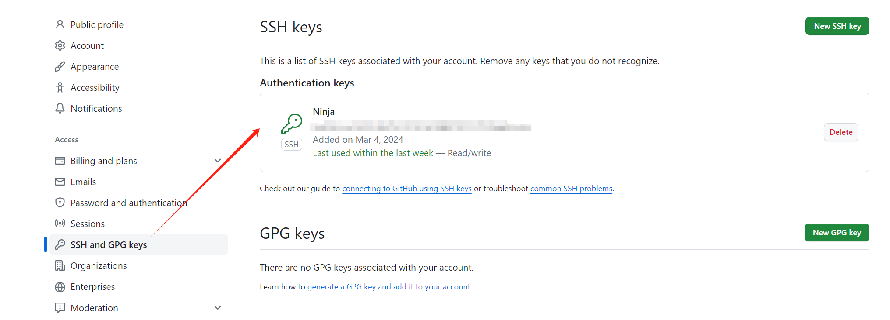
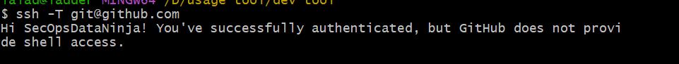

# GitHub-Use
记录使用Git和GitHub的日常


### 建立仓库和ssh初始化
 - 首先下载git，不多做说明
 - 下载完成之后，生成密钥，由于我是windows，且不喜欢在C盘目录下，所以设置了保存密钥的路径
   ``` 
   ssh-keygen -t ed25519 -C "funokobe@gmail.com" -f D:\usage tool\dev tool\ssh 
   ``` 
- 启用ssh代理
  ~~~
  eval $(ssh-agent)
  ~~~

- 将保存的密钥添加到GitHub账户

  ~~~ 
  ssh-add "D:\usage tool\dev tool\ssh\id_ed25519" 
  ~~~
  
- 测试是否可以正常连接到GitHub
  ~~~
   ssh -T git@github.com
  ~~~
  

- 配置自己的用户名和邮箱
  ~~~
  git config --global user.name "mygitcode"
  git config --global user.email "xxxxxxx@gmail.com"
  ~~~
  
>由于每次新开一个终端都要重新启用ssh代理，所以一次解决。
> 在 Git Bash 中运行以下命令打开该文件：
> ~~~
> vim ~/.ssh/config
> ~~~
> 在打开的配置文件中添加以下内容
> ~~~
> Host github.com
>    HostName github.com
>    IdentityFile "D:/usage tool/dev tool/ssh/id_rsa"
> ~~~
>- 这个配置指定了当连接到 github.com 时要使用的 SSH 密钥的路径。 
>- Host 行定义了你要连接的主机名或者主机别名。
>- HostName 行指定了实际的主机名。
>- IdentityFile 行指定了你的 SSH 私钥文件的路径。 (**请注意，文件路径需要用引号括起来，以防止路径中的空格被误解。**)
>- 保存并关闭文件：
>- 在 Vim 编辑器中，你可以按下 Esc 键，然后输入 :wq 并按下 Enter 键保存并关闭文件

### git基础操作
1. 创建本地仓库
  ~~~
  mkdir my_repository
  cd my_repository
  ~~~
2. 初始化一个新的 Git 仓库
  ~~~
  git init
  ~~~
3. 添加文件到仓库：-要添加到仓库的文件复制到仓库目录中。然后运行以下命令：
  ~~~
  git commit -m "Initial commit"
  ~~~
4. 提交文件到仓库
  ~~~
  git commit -m "Initial commit"
  ~~~
5. 在 GitHub 上创建远程仓库,获取仓库的 URL。
6. 将本地仓库与远程仓库关联：
  ~~~
  git remote add origin <远程仓库的URL>
  
  # 例如
  git remote add origin https://github.com/SecOpsDataNinja/GitHub-Use.git
  ~~~
7. 推送本地仓库到远程仓库
  ~~~
  git push -u origin main
  ~~~